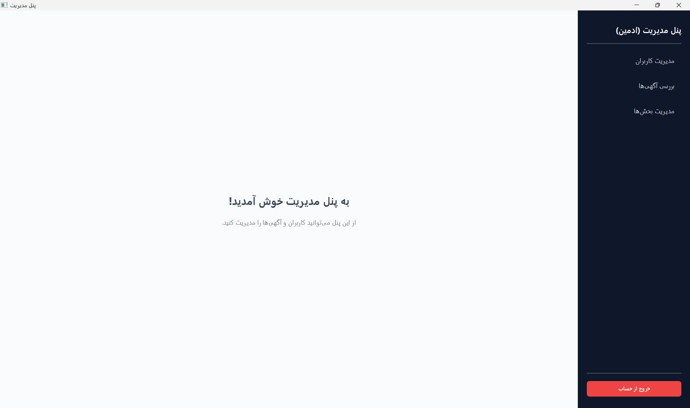

# 🛒 Khorosh Java Project
## سامانه خرید و فروش دست دوم

یک سامانه دسکتاپ-سرور برای خرید و فروش کالاهای دست دوم که با استفاده از `Java`, `Spring Boot`, `JavaFX`, `Maven` و `CSS` توسعه داده شده است. این پروژه با معماری چندبخشی طراحی شده و شامل یک بک‌اند سرویس‌محور و یک فرانت‌اند گرافیکی مبتنی بر جاوا اف ایکس است.

---

## 📖 معرفی پروژه
این پروژه با هدف پیاده‌سازی یک سامانه کاربردی برای خرید و فروش کالاهای دست دوم توسعه داده شده است. کاربران می‌توانند در این سیستم ثبت‌نام کنند، وارد حساب خود شوند، آگهی‌ها را مشاهده کنند، جزئیات هر آگهی را ببینند و با سایر کاربران وارد گفتگو شوند. همچنین بخش مدیریت سیستم برای کنترل کاربران، بررسی بخش‌های مختلف سامانه و مدیریت فرایندهای اصلی در نظر گرفته شده است.

---

## 👥 اعضای تیم
- **آرین صفری** 🎨 (توسعه‌دهنده فرانت‌اند)
- **علی مهدی‌پور گنجی** ⚙️ (توسعه‌دهنده بک‌اند)

> با وجود تمرکز بیشتر هر عضو روی یک بخش خاص، هر دو نفر در توسعه کلی پروژه مشارکت مستقیم و مؤثر داشته‌اند.

---

## 🛠 تکنولوژی‌ها و ابزارها

- ☕ **Java**
- 🚀 **Spring Boot**
- 🖥 **JavaFX**
- 📦 **Maven**
- 🎨 **CSS**
- 🐙 **Git**
- 📑 **Swagger & Postman**
- 🐘 **PostgreSQL**


---

## 🔍 معرفی تکنولوژی‌ها و مفاهیم

- **Java**: زبان شیءگرا و قدرتمندی که پایه و اساس منطق سیستم را در هر دو بخش بک‌اند و فرانت‌اند تشکیل می‌دهد.
- **Spring Boot**: فریم‌ورک محبوب جاوا که با ساده‌سازی تنظیمات، امکان توسعه سریع سرویس‌های بک‌اند را فراهم می‌کند.
- **JavaFX**: پلتفرمی برای طراحی رابط کاربری گرافیکی  مدرن و منعطف برای اپلیکیشن‌های دسکتاپ.
- **Maven**: ابزاری برای مدیریت کتابخانه‌ها  تنظیمات پروژه و خودکارسازی فرآیند ساخت و اجرا.
- **CSS**: زبانی برای زیباسازی و مدیریت ظاهر المان‌های بصری در محیط فرانت‌اند.
- **Git**: ابزار حیاتی برای کنترل تغییرات کد، پیگیری تاریخچه پروژه و تسهیل همکاری بین اعضای تیم.
- **Swagger & Postman**: ابزارهایی برای مستندسازی خودکار ها و ارسال درخواست‌های تست جهت اطمینان از صحت عملکرد سرویس‌ها.
- **PostgreSQL**: یک سیستم مدیریت دیتابیس رابطه‌ای  پیشرفته، امن و با قابلیت اطمینان بالا برای ذخیره داده‌های اصلی برنامه.
- **SQLite**: دیتابیس مبتنی بر فایل و بسیار سبک که بدون نیاز به سرور، برای تست‌های سریع و محیط‌های توسعه ایده‌آل است.
- **JWT (JSON Web Token)**: استانداردی برای انتقال امن اطلاعات بین کلاینت و سرور. در این پروژه، با تولید توکن‌های رمزنگاری‌شده پس از ورود موفق کاربر، مدیریت نشست  و احراز هویت را به صورت   امن انجام می‌دهد.

---

## 🏗 معماری کلی پروژه

### Backend
- پیاده‌سازی منطق اصلی سیستم
- ارائه REST API
- مدیریت امنیت، داده‌ها و احراز هویت

### Frontend
- پیاده‌سازی رابط کاربری گرافیکی
- مدیریت ناوبری (Navigation)
- ارتباط با APIهای بک‌اند

---

## 🏗 ساختار کلی مخزن
```text
divar-java-project/
├── Backend/
├── Frontend/
├── .gitignore
└── README.md

---
## 🏗 ساختار کلی بکند
Backend/src/main/java/org/example/backend/
├── config/          # تنظیمات (Security, JWT)
├── controller/      # REST APIها
├── service/         # منطق برنامه
├── repository/      # دیتابیس (JPA)
├── entity/          # موجودیت‌ها
└── dto/             # مدل‌های انتقال داده

---
## 🏗 ساختار کلی فرانت
Frontend/src/main/java/org/example/frontend/
├── auth/            # ورود و ثبت‌نام
├── chat/            # چت
├── advertisement/   # مدیریت آگهی‌ها
└── shared/          # کامپوننت‌های مشترک

قابلیت‌ها
✅ ثبت‌نام و ورود امن
📢 مشاهده آگهی‌ها
💬 چت بین کاربران
🛡 پنل مدیریت

---

⚡   راهنمای اجرا
First run BackendApplication
Second run HelloApplication
```
### Pictures

<div align="center">

<figure>
  
  <figcaption>login.jpg</figcaption>
</figure>

<figure>
  
  <figcaption>sign-up.jpg</figcaption>
</figure>

<figure>
  
  <figcaption>Main-Page.jpg</figcaption>
</figure>

<figure>
  
  <figcaption>Admin-panel.jpg</figcaption>
</figure>

<figure>
  
  <figcaption>Cities.jpg</figcaption>
</figure>

<figure>
  
  <figcaption>User-Controller.jpg</figcaption>
</figure>

<figure>
  
  <figcaption>Add-Advertisement.jpg</figcaption>
</figure>

<figure>
  
  <figcaption>Add-to-Favorites.jpg</figcaption>
</figure>

<figure>
  
  <figcaption>Admin-Review-Advertisement.jpg</figcaption>
</figure>

<figure>
  
  <figcaption>Advertisement-Details.jpg</figcaption>
</figure>

<figure>
  
  <figcaption>Comment-and-rate.jpg</figcaption>
</figure>

<figure>
  
  <figcaption>favorities.jpg</figcaption>
</figure>

<figure>
  
  <figcaption>Seller-Advertisement-Controller.jpg</figcaption>
</figure>

<figure>
  
  <figcaption>Advance-search.jpg</figcaption>
</figure>

<figure>
  
  <figcaption>advance-search-1.jpg</figcaption>
</figure>

<figure>
  
  <figcaption>advance-search-2.jpg</figcaption>
</figure>
<figure>
  
  <figcaption>Edit-advertisement.png</figcaption>
</figure>
<figure>
  
  <figcaption>Edit-advertisement1.png</figcaption>
</figure>

</div>

---
